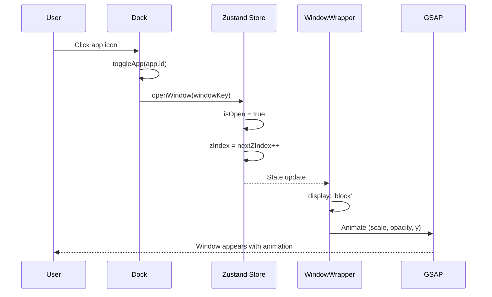
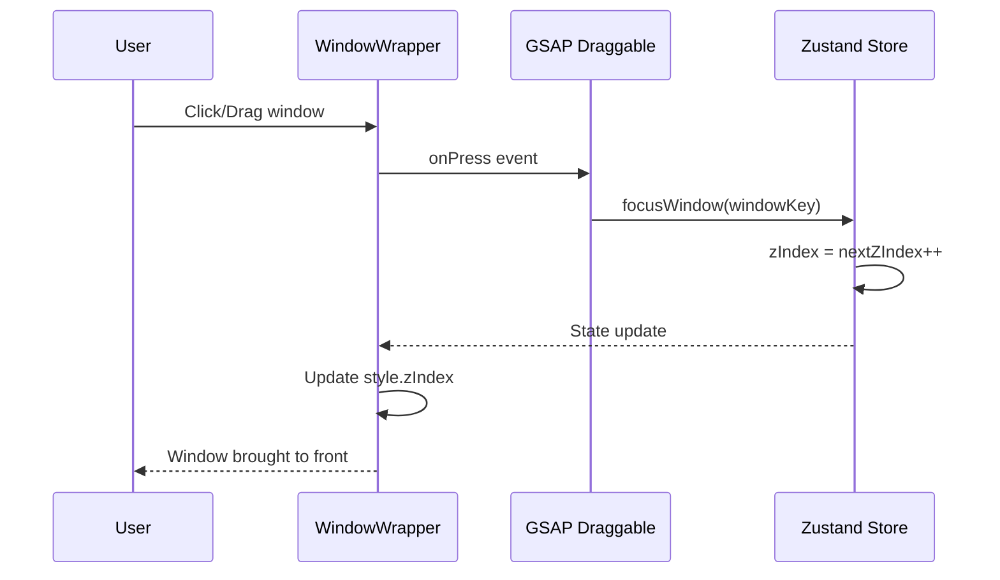
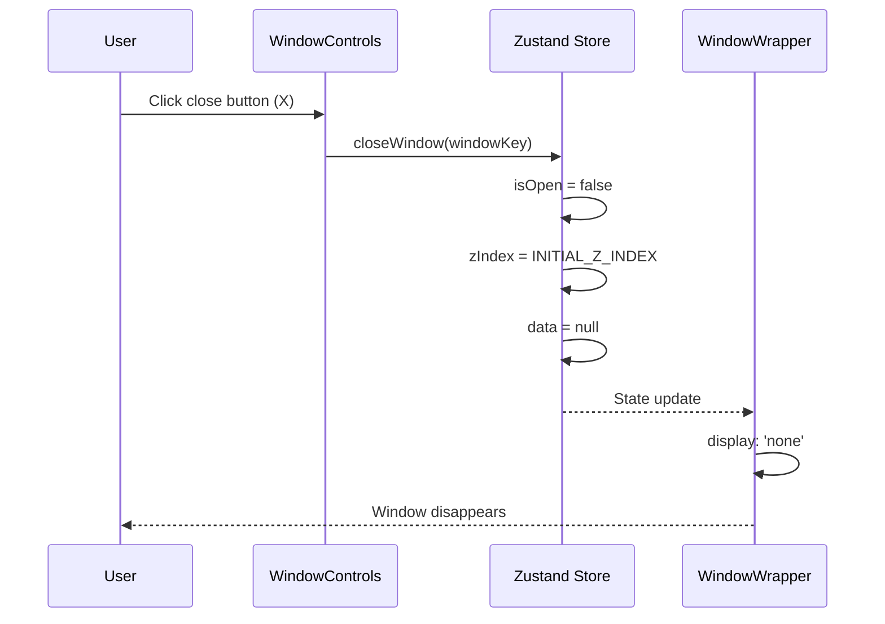
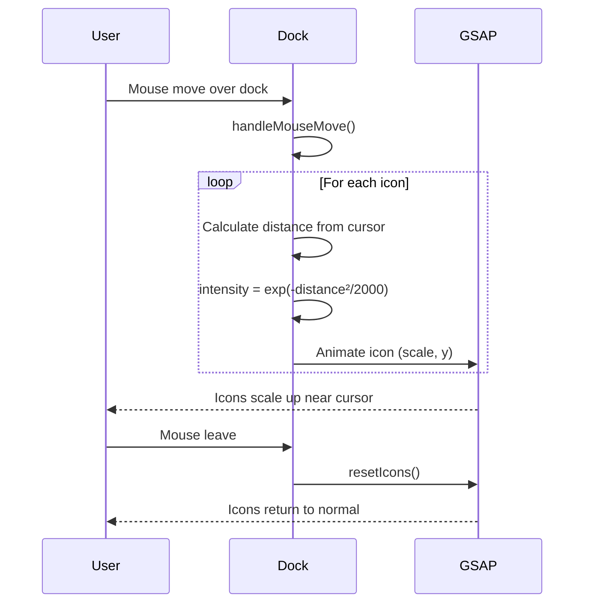

This is a [Next.js](https://nextjs.org/) project bootstrapped with [`create-next-app`](https://github.com/vercel/next.js/tree/canary/packages/create-next-app).

## Features

### macOS-Style Desktop UI
- **Dock**: 마우스 호버 시 아이콘이 부드럽게 확대되는 macOS 스타일 Dock
- **Draggable Windows**: GSAP Draggable을 활용한 드래그 가능한 윈도우 시스템
- **Window Management**: z-index 기반 윈도우 포커스 및 상태 관리

### Window Applications
| Window | Description |
|--------|-------------|
| **Finder** | 프로젝트 폴더 탐색, 파일 미리보기 |
| **Terminal** | 기술 스택 표시 |
| **Safari** | 블로그 포스트 목록 |
| **Resume** | PDF 이력서 뷰어 |
| **Contact** | 소셜 링크 (GitHub, Blog, Mail, Instagram) |
| **Photos** | 이미지 갤러리 |

### Project Detail Pages
- **MDX 기반 콘텐츠**: Markdown + JSX로 프로젝트 상세 설명
- **코드 하이라이팅**: Shiki + rehype-pretty-code
- **반응형 clamp()**: 뷰포트에 따라 자동 조절되는 타이포그래피

### Animations
- **GSAP**: 윈도우 열기/닫기, Dock 호버 효과
- **Smooth Transitions**: 부드러운 UI 인터랙션

## Architecture

### Component Hierarchy

```
RootLayout (app/layout.tsx)
└── Page (app/page.tsx)
    ├── Navbar
    ├── Welcome
    ├── Dock
    └── WindowWrapper (HOC)
        ├── TerminalWindow
        ├── FinderWindow
        └── ...
```

### Sequence Diagrams

#### 1. Window Open Flow



#### 2. Window Focus Flow



#### 3. Window Close Flow



#### 4. Dock Hover Animation Flow



### State Management

```
┌─────────────────────────────────────┐
│        Zustand Window Store         │
├─────────────────────────────────────┤
│  windows: {                         │
│    terminal: { isOpen, zIndex, data }│
│    finder:   { isOpen, zIndex, data }│
│    ...                              │
│  }                                  │
│  nextZIndex: number                 │
├─────────────────────────────────────┤
│  openWindow(key, data?)             │
│  closeWindow(key)                   │
│  focusWindow(key)                   │
└─────────────────────────────────────┘
```

### Tech Stack

| Category | Technologies |
|----------|--------------|
| Framework | Next.js 16, React 19, TypeScript 5 |
| Styling | Tailwind CSS 4 |
| State | Zustand 5 (with Immer) |
| Animation | GSAP 3.13, @gsap/react |
| Icons | Lucide React |

## Getting Started

First, run the development server:

```bash
npm run dev
# or
yarn dev
# or
pnpm dev
# or
bun dev
```

Open [http://localhost:3000](http://localhost:3000) with your browser to see the result.

You can start editing the page by modifying `app/page.tsx`. The page auto-updates as you edit the file.

This project uses [`next/font`](https://nextjs.org/docs/basic-features/font-optimization) to automatically optimize and load Inter, a custom Google Font.

## Learn More

To learn more about Next.js, take a look at the following resources:

- [Next.js Documentation](https://nextjs.org/docs) - learn about Next.js features and API.
- [Learn Next.js](https://nextjs.org/learn) - an interactive Next.js tutorial.

You can check out [the Next.js GitHub repository](https://github.com/vercel/next.js/) - your feedback and contributions are welcome!

## Deploy on Vercel

The easiest way to deploy your Next.js app is to use the [Vercel Platform](https://vercel.com/new?utm_medium=default-template&filter=next.js&utm_source=create-next-app&utm_campaign=create-next-app-readme) from the creators of Next.js.

Check out our [Next.js deployment documentation](https://nextjs.org/docs/deployment) for more details.
